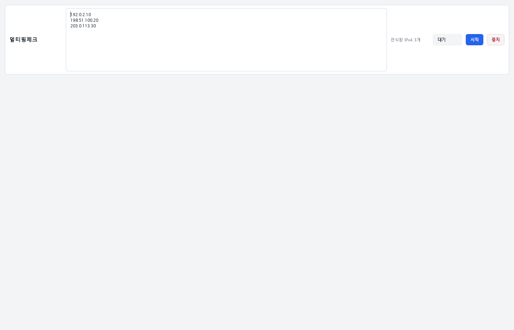
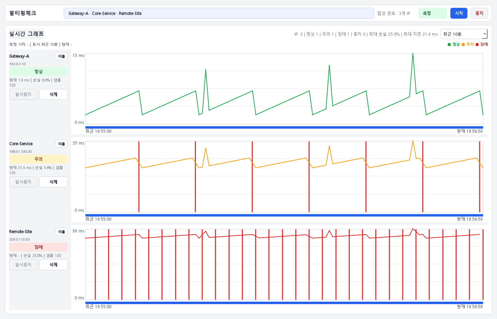
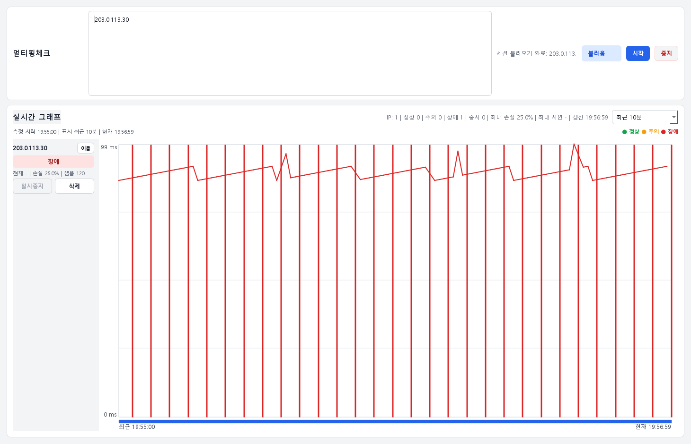
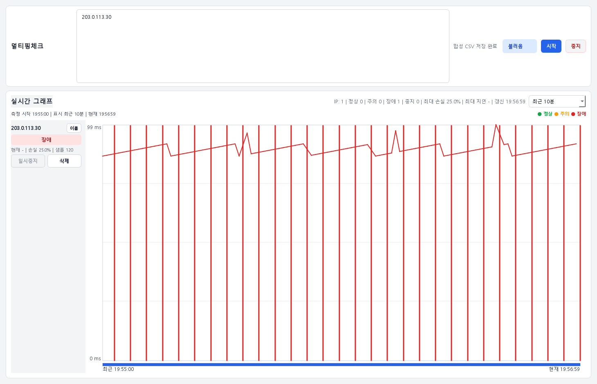

# 현재 사용 화면

현재 UI는 대상 입력과 독립 그래프에 집중합니다. 아래 두 장은 **Windows의 실제 PySide6 MainWindow**를 합성 데이터로 렌더링한 화면이며, 실제 ICMP 패킷은 보내지 않았습니다. 버전은 **0.2.0**입니다.

## 1. 대상 입력



- **행동:** IPv4를 한 줄에 하나씩 입력합니다. 실제 사용에서는 권한이 있는 대상만 입력한 뒤 `시작`을 누릅니다.
- **읽을 값:** `인식된 IPv4 3개`와 `대기` 상태를 확인합니다. 예시는 RFC 5737 주소이므로 복사해 실측하지 않습니다.
- **다음 행동:** 측정이 시작되면 입력 영역이 접히고 대상별 그래프가 나타납니다. 화면 아래의 빈 공간은 시작 전 실제 레이아웃입니다.

## 2. 여러 대상 비교



- **행동:** 같은 시각에 여러 대상의 상태를 비교하고 필요할 때 `이름`, 대상별 `일시중지` 또는 `삭제`를 사용합니다. 작업 전체는 상단 `중지`로 끝냅니다.
- **읽을 값:** 예시는 대상별 120표본입니다. Gateway-A는 손실 0%, Core-Service는 7/120(약 5.8%), Remote-Site는 30/120(25%)입니다. 그래프의 끊김과 상태 문구를 함께 봅니다.
- **주의:** 합성 파형은 2026-08-21 19:55:00부터 2분이며 현재 회선 품질을 뜻하지 않습니다. 화면의 `최근 10분`은 표시 범위 설정으로, 10분을 측정했다는 뜻이 아닙니다. 정상/장애 표시는 관측 분류이며 장비 원인 확정이 아닙니다.
- **다음 행동:** 실제 장애 시각과 응용 서비스 증상을 대조합니다. 캡처를 공유하기 전 주소·별칭·조직 정보를 제거합니다.

## 저장과 내보내기의 현재 경계

측정 worker는 segmented CSV와 Session Index를 기록합니다. 그러나 **저장 세션 재열기·내보내기 버튼은 현재 일반 UI에서 숨겨져 있고 메뉴 진입점도 없습니다.** 소스에 함수가 존재한다는 사실과 사용자가 기능에 접근할 수 있다는 사실을 구분해야 합니다.

이 동작은 [고급 기능 화면 제거 commit](https://github.com/sebia1993/multi-target-ping-monitor/commit/381371c8e6c13f1b33a3b3e7717b43cdbee09213) 및 [현재 UI 구성](../app/ui/main_window.py)의 `set_advanced_features_visible`·`_build_menu_bar`에서 확인할 수 있습니다. 아래는 채용 검토용 **개발 검증 부록**이며, 사용자 조작 안내가 아닙니다.

## 개발 검증 부록

### 저장한 합성 세션 재열기



캡처 도구가 실제 `SessionLogWriter`로 CSV를 쓰고, `SessionIndexStore`에 보관 상태로 등록한 뒤 `MainWindow.open_selected_session()`을 호출했습니다. 실제 `SessionOpenWorker`가 디스크에서 읽어 `불러옴` 상태와 120표본·25% 손실을 표시했습니다. 일반 사용자가 누를 수 있는 세션 메뉴를 추가한 화면은 아닙니다.

### 실제 CSV exporter 결과



캡처 도구가 파일 선택 경로만 격리된 출력 폴더로 주입하고 실제 `export_selected_session()`과 `ExportWorker`를 실행했습니다. 화면 상태는 `합성 CSV 저장 완료`로 식별자를 줄였습니다. [생성 CSV](images/session-demo.csv)에는 summary·지표·원시 120표본이 포함되며 30개 timeout을 다시 읽어 검사했습니다.

CSV의 원인 후보 문구는 자동 분석 결과입니다. 이 fixture에는 중간 hop 관측이 없으므로 `이전 Hop은 정상` 같은 일반 안내를 이 사례의 확인된 사실로 받아들이면 안 됩니다. 이 부록은 저장/재열기/파일 생성 근거이며 원인 분석 정확도나 현장 장애 재현의 근거가 아닙니다.

## 캡처 출처와 재현

- 제품/도구: `0.2.0`, [render_docs_screenshots.py](../scripts/render_docs_screenshots.py).
- 환경: GitHub Actions `windows-latest`, Python 3.12, 저장소의 hash-pinned Qt 의존성, Qt offscreen/Fusion.
- 캡처 source SHA: `f0e772454b0c8dc5a0d1229a663a2dbb128bc1d8`. [Windows 캡처 실행](https://github.com/sebia1993/multi-target-ping-monitor/actions/runs/34176147682).
- 정확한 OS·파일 SHA-256: [capture-manifest.json](images/capture-manifest.json). 화면/도구 commit에서 캡처한 다음 PNG를 별도 commit하므로 manifest SHA와 이미지 저장 commit은 다를 수 있습니다.
- 검증: 실제 사용자 데이터 경로를 임시 폴더로 격리하고 probe를 실행하지 않습니다. 동작 중으로 보이는 화면도 합성 관측입니다. Windows GUI/드라이버·방화벽·실제 장비 검증은 포함하지 않습니다.

Windows PowerShell에서 저장소 루트 기준:

```powershell
py -3.12 -m venv .venv
.\.venv\Scripts\python.exe -m pip install --require-hashes -r requirements-dev.lock
.\.venv\Scripts\python.exe scripts/render_docs_screenshots.py --output-dir artifacts/docs-images
```

[캡처 workflow](../.github/workflows/docs-screenshots.yml)는 PNG·CSV·manifest를 artifact로 남깁니다. macOS에서도 같은 도구로 격리된 Qt 렌더를 확인할 수 있지만 Windows 렌더·제품 CI 결과와 구분해야 합니다.
